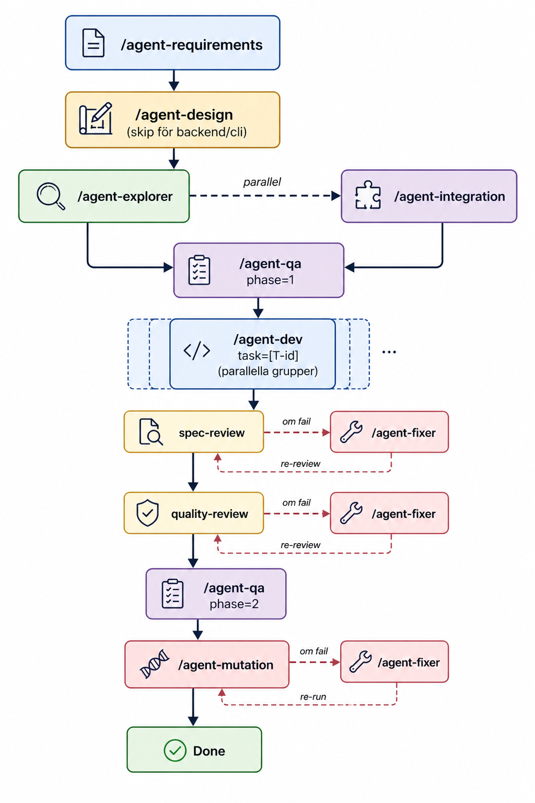

# agent-squad

A spec-driven AI agent team for feature development.
Each agent has one job, minimal context, and clear outputs.

Inspired by [meganide/specops](https://github.com/meganide/specops).
Built with a focus on maximum output, minimum tokens, and zero shortcuts.

---

## The problem

Single-session AI coding degrades over time.
Context fills up. Quality drops. You end up babysitting.

Most AI agent systems solve this with brute force —
more agents, more tokens, more complexity.

We solve it differently:
- Every agent reads only what it needs
- Every agent produces structured output the next agent consumes
- No agent does more than one job
- Contracts are defined before code is written
- Tests are written before dev starts

---

## The pipeline
 

 
```
/agent-requirements
        ↓
/agent-design (skip for backend/cli)
        ↓
/agent-integration ──── parallel ──── /agent-qa phase=1
        ↓                                      ↓
/agent-dev task=[T-id] (one per task, parallel groups)
        ↓
/agent-qa phase=2
        ↓
/agent-mutation
```
 
---

## Agents

| Agent | Job | Output |
|-------|-----|--------|
| requirements | Interview user, produce spec | context/ files |
| design | Build design system + Storybook | src/tokens, src/components |
| integration | Define contracts + execution plan | contracts.md, execution-plan.md |
| qa | Write tests + verify quality | tests/, manual-tests/, qa-report.md |
| dev | Implement one task against contracts | feature code |
| mutation | Verify tests catch real bugs | mutation-report.md |

---

## Standards

| File | Applies to |
|------|-----------|
| agents/code-standards.md | All dev agents |
| agents/design-standards.md | Design agent |

---

## Quick start

### 1. Copy agents to your project
```bash
cp -r agents/ your-project/.claude/agents/
cp -r integrations/claude-code/ your-project/.claude/commands/
```

### 2. Run requirements agent
```
/agent-requirements
```

### 3. Follow the pipeline
The requirements agent tells you what to run next.
Each agent tells you what to run after it.

---

## Context files

All agents read from and write to `context/`.
Never edit these manually — they are agent outputs.

```
context/
  project.md          ← project profile
  features.md         ← feature specs
  design.md           ← design requirements
  technical.md        ← tech decisions
  test-criteria.md    ← test scenarios
  roadmap.md          ← deferred features
  open-questions.md   ← unresolved questions
  contracts.md        ← interfaces and schemas
  execution-plan.md   ← task ordering
  design-system.md    ← available components
  tests/              ← automated tests
  manual-tests/       ← manual test scenarios
  qa-report.md        ← QA summary
  mutation-report.md  ← mutation testing results
```

---

## Philosophy

**Spec first.** Nothing gets built without a spec.
**Contracts before code.** Dev agents never guess interfaces.
**Tests before dev.** QA writes tests before dev starts.
**One job per agent.** No agent does more than it should.
**Minimal context.** Every agent reads only what it needs.
**No shortcuts.** Code standards are non-negotiable.

---

## Supported languages

Agents adapt to your language and framework.
Code standards and design standards cover:

- TypeScript / JavaScript (React, Next.js, Node.js)
- C# (.NET, ASP.NET)
- Python
- Swift / SwiftUI
- Kotlin / Jetpack Compose
- Flutter / Dart
- Any other language via web search

---

## Contributing

This project is in active development.
Contributions welcome — especially:
- New language-specific standards
- Integrations for other AI coding tools (Cursor, Windsurf)
- Improvements to existing agents

---

## Credits

Inspired by [meganide/specops](https://github.com/meganide/specops)
and the excellent write-up by Renas Hassan on AI agent teams.

---

## License

MIT