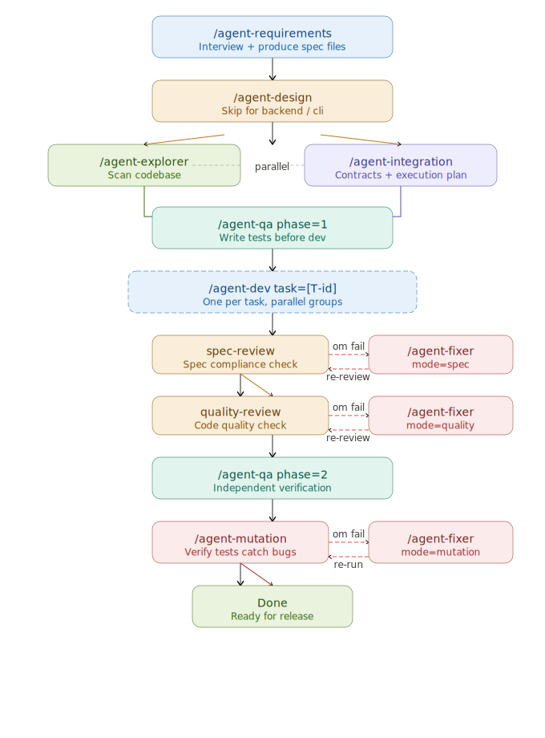
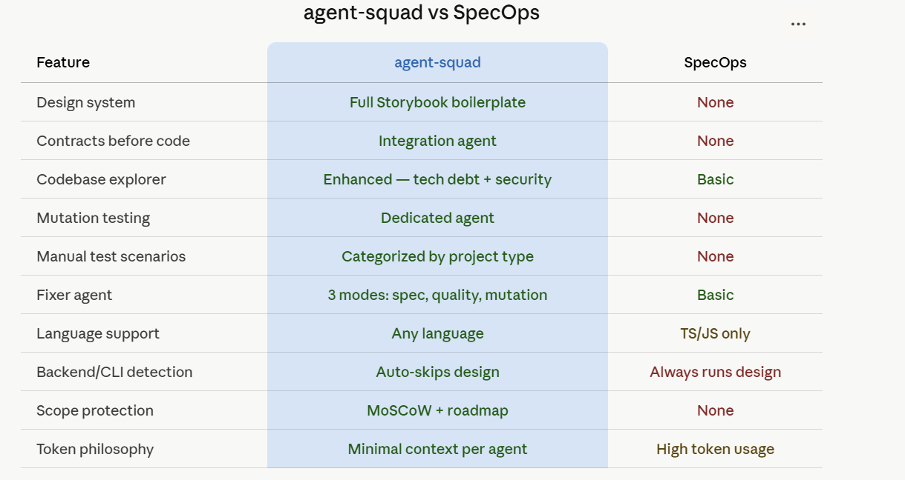
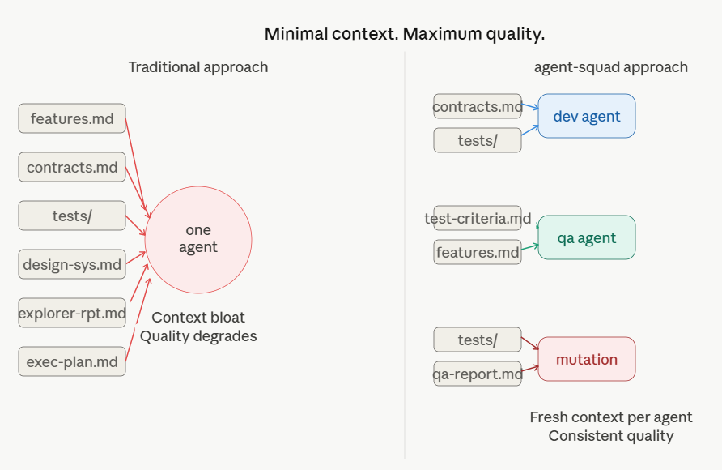

# agent-squad

A spec-driven AI agent team for feature development.
Each agent has one job, minimal context, and clear outputs.

Inspired by [meganide/specops](https://github.com/meganide/specops).
Built with a focus on maximum output, minimum tokens, and zero shortcuts.

---

## The problem

Single-session AI coding degrades over time.
Context fills up. Quality drops. You end up babysitting.

Most AI agent systems solve this with brute force —
more agents, more tokens, more complexity.

We solve it differently:
- Every agent reads only what it needs
- Every agent produces structured output the next agent consumes
- No agent does more than one job
- Contracts are defined before code is written
- Tests are written before dev starts
- Every output is independently verified

---

## The pipeline



```
/agent-requirements
        ↓
/agent-design (skip for backend/cli)
        ↓
/agent-explorer ──── parallel ──── /agent-integration
        ↓                                  ↓
        └──────── /agent-qa phase=1 ───────┘
                          ↓
/agent-dev task=[T-id] (one per task, parallel groups)
                          ↓
              spec-review → fail → /agent-fixer → re-review (max 2x)
                          ↓
          quality-review → fail → /agent-fixer → re-review (max 2x)
                          ↓
              /agent-qa phase=2
                          ↓
        /agent-mutation → fail → /agent-fixer → re-run
                          ↓
                       ✅ Done
```

---

## Agents

| Agent | Job | Output |
|-------|-----|--------|
| requirements | Interview user, produce spec | context/ files |
| design | Build design system + Storybook | src/tokens, src/components, context/design-system.md |
| explorer | Scan codebase, report patterns and conflicts | context/explorer-report.md |
| integration | Define contracts + execution plan | context/contracts.md, context/execution-plan.md |
| qa | Write tests + verify quality (2 phases) | context/tests/, context/manual-tests/, context/qa-report.md |
| dev | Implement one task against contracts | feature code |
| fixer | Fix review and mutation failures | updated code or tests |
| mutation | Verify tests catch real bugs | context/mutation-report.md |

---

## Standards

| File | Applies to |
|------|-----------|
| agents/code-standards.md | All dev agents |
| agents/design-standards.md | Design agent |

---

## Quick start

### 1. Enable agent teams in Claude Code
```json
// ~/.claude/settings.json
{
  "env": {
    "CLAUDE_CODE_EXPERIMENTAL_AGENT_TEAMS": "1"
  }
}
```

### 2. Copy agents to your project
```bash
cp -r agents/ your-project/.claude/agents/
cp -r integrations/claude-code/ your-project/.claude/commands/
```

### 3. Run requirements agent
```
/agent-requirements
```

### 4. Follow the pipeline
Each agent tells you what to run next.

---

## Context files

All agents read from and write to `context/`.
Never edit these manually — they are agent outputs.

```
context/
  project.md            ← project profile (requirements)
  features.md           ← feature specs (requirements)
  design.md             ← design requirements (requirements)
  technical.md          ← tech decisions (requirements)
  test-criteria.md      ← test scenarios (requirements)
  roadmap.md            ← deferred features (requirements)
  open-questions.md     ← unresolved questions (requirements)
  explorer-report.md    ← codebase analysis (explorer)
  contracts.md          ← interfaces and schemas (integration)
  execution-plan.md     ← task ordering (integration)
  design-system.md      ← available components (design)
  tests/                ← automated tests (qa phase 1)
  manual-tests/         ← manual test scenarios (qa phase 1)
  reviews/              ← spec and quality review reports
  qa-report.md          ← QA summary (qa phase 2)
  mutation-report.md    ← mutation testing results (mutation)
```

---

## How we differ from SpecOps



| | agent-squad | SpecOps |
|---|---|---|
| Design system | ✅ Full Storybook boilerplate | ❌ None |
| Contracts before code | ✅ Integration agent | ❌ None |
| Explorer | ✅ + tech debt + security flags | ✅ Basic |
| Mutation testing | ✅ Dedicated agent | ❌ None |
| Manual tests | ✅ Categorized by project type | ❌ None |
| Fixer agent | ✅ 3 modes (spec/quality/mutation) | ✅ Basic |
| Language support | ✅ Any language | TS/JS only |
| Backend/CLI projects | ✅ Skips design automatically | ❌ Always runs design |
| Scope protection | ✅ MoSCoW + roadmap | ❌ None |
| Token philosophy | Minimal context per agent | High token usage |

---

## Philosophy



**Spec first.** Nothing gets built without a spec.
**Contracts before code.** Dev agents never guess interfaces.
**Tests before dev.** QA writes tests before dev starts.
**One job per agent.** No agent does more than it should.
**Minimal context.** Every agent reads only what it needs.
**Independent verification.** Never trust self-reports.
**No shortcuts.** Code standards are non-negotiable.

---

## Supported languages

Agents adapt to your language and framework.

- TypeScript / JavaScript (React, Next.js, Node.js)
- C# (.NET, ASP.NET)
- Python
- Swift / SwiftUI
- Kotlin / Jetpack Compose
- Flutter / Dart
- Any other language via web search

---

## Contributing

This project is in active development.
Contributions welcome — especially:
- New language-specific standards
- Integrations for Cursor, Windsurf, and other AI coding tools
- Improvements to existing agents
- Real-world usage reports and bug fixes

---

## Credits

Inspired by [meganide/specops](https://github.com/meganide/specops)
and the excellent write-up by Renas Hassan on AI agent teams.

---

## License

MIT