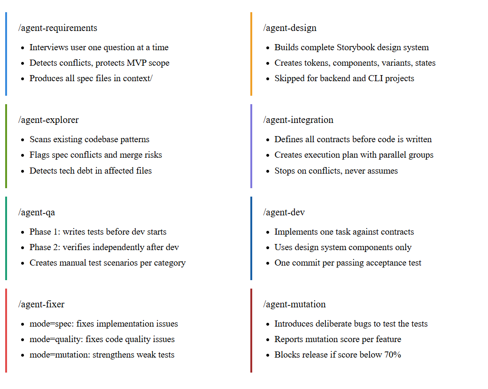
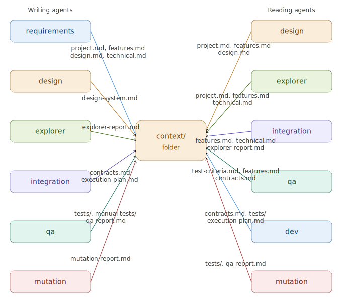

# Agents



A guide to every agent in agent-squad — what it does, what it reads, and what it produces.

---

## How agents connect



Every agent communicates through files in `context/`.
No agent calls another agent directly.
No agent reads another agent's memory.
Everything is explicit, structured, and inspectable.

---

## /agent-requirements

**Job:** Interview the user and produce the complete spec.

The most important agent in the pipeline. Everything downstream depends on the quality of its output. It asks one question at a time, pushes back on vague answers, detects conflicts, and actively protects MVP scope.

**Reads:**
Nothing — it starts from scratch.

**Writes:**
```
context/project.md          → project profile
context/features.md         → feature specs with acceptance criteria
context/design.md           → design requirements
context/technical.md        → tech decisions
context/test-criteria.md    → test scenarios per dimension
context/roadmap.md          → deferred features
context/open-questions.md   → unresolved questions
```

**Key behaviors:**
- One question at a time — always
- Presents options with tradeoffs for technical decisions
- Detects and resolves conflicts before continuing
- MoSCoW prioritization when Must Have list grows beyond 5
- Deferred features saved to roadmap with feature IDs
- Searches web for unknown technical decisions using project context
- Final confirmation before writing any files

**Skips design step if:** `project_type == backend or cli`

---

## /agent-design

**Job:** Build the complete design system before dev starts.

Dev agents never create components. They only use components from the design system. The design agent ensures every component needed for every feature exists, is documented, and follows accessibility standards.

**Reads:**
```
context/project.md
context/features.md
context/design.md
```

**Writes:**
```
src/tokens/                 → design tokens
src/components/             → component library
context/design-system.md    → component index for dev agents
```

**Key behaviors:**
- Presents 3 color palette options before building
- Presents component list for user confirmation before building
- Every component handles all states: default, hover, focus, active, disabled, loading, error, empty
- Every component documented in Storybook (TS/JS), Swift Previews, Compose Previews, or Widgetbook
- WCAG 2.1 AA required for every component — no exceptions
- Validates that design system covers every feature in spec before finishing

**Skipped for:** `project_type == backend or cli`

---

## /agent-explorer

**Job:** Scan the codebase so agents do not reinvent or conflict with what already exists.

**Reads:**
```
context/project.md
context/features.md
context/technical.md
```

**Writes:**
```
context/explorer-report.md
```

**Key behaviors:**
- Documents existing patterns with real file examples
- Identifies integration points and existing utilities
- Maps test infrastructure — framework, location, helpers, exact commands
- Flags spec conflicts against existing codebase
- Identifies merge conflict risks for integration agent
- Flags tech debt only in files new features will touch
- Notes security observations only in affected files
- Checks for design system overlap (FE projects only)

**Runs in parallel with:** `/agent-integration`

---

## /agent-integration

**Job:** Define all contracts and create the execution plan.

Nothing gets built before the contracts are defined. Every interface, every API shape, every database schema is specified here. Dev agents build against contracts — they never guess.

**Reads:**
```
context/project.md
context/features.md
context/technical.md
context/design-system.md
context/explorer-report.md
```

**Writes:**
```
context/contracts.md        → all interfaces, types, API shapes, DB schema
context/execution-plan.md   → tasks, dependencies, parallel groups
```

**Key behaviors:**
- Detects conflicts between features before writing contracts
- Never resolves conflicts independently — always asks user
- Defines canonical entity shapes used across all features
- Tasks split by behavior (simple features) or by layer (complex features)
- Identifies parallel execution groups to maximize dev speed
- Marks merge conflict risk files from explorer report

**Runs in parallel with:** `/agent-qa phase=1`

---

## /agent-qa

**Job:** Write tests before dev starts. Verify quality after dev finishes.

Two phases. Phase 1 runs before dev. Phase 2 runs after dev. They are never mixed.

**Phase 1 reads:**
```
context/project.md
context/features.md
context/test-criteria.md
context/contracts.md
```

**Phase 1 writes:**
```
context/tests/[task-id].test.ts     → automated tests per task
context/manual-tests/visual.md      → if FE project
context/manual-tests/ux-flows.md    → if FE project
context/manual-tests/accessibility.md → if medium+ sensitivity
context/manual-tests/devices.md     → if consumer-facing
context/manual-tests/performance.md → if large scale
context/manual-tests/security.md    → if high sensitivity
context/manual-tests/exploratory.md → always
```

**Phase 2 reads:**
All committed code + all test files

**Phase 2 writes:**
```
context/qa-report.md
```

**Key behaviors:**
- Identifies gaps in test-criteria.md and flags them explicitly
- Test dimensions determined by data_sensitivity
- Never tests implementation details — always tests behavior through public interfaces
- Phase 2 never trusts dev agent's self-report — verifies independently
- Flags weak tests with specific improvement recommendations

---

## /agent-dev

**Job:** Implement one task against contracts until acceptance tests pass.

One agent per task. Dev agents work in parallel groups as defined by the execution plan. They never create components — only use what the design system provides.

**Reads:**
```
context/project.md
context/features.md
context/technical.md
context/contracts.md
context/execution-plan.md
context/design-system.md    → FE only
context/code-standards.md
context/tests/[task-id].test.ts
context/explorer-report.md
```

**Writes:**
Feature code. One commit per passing acceptance test.

**Key behaviors:**
- Checks all task dependencies before starting
- Stops if a required component is missing from design system
- Implements against contracts — never deviates
- Self-checks every function: does it work beyond test inputs?
- One commit per passing test with descriptive commit message
- Checks for existing commit conventions before using default
- After reporting: makes no further tool calls — shutdown immediately

**Commit format (default):**
```
feat([feature-id]): [what behavior now works]
```

---

## /agent-fixer

**Job:** Fix exactly what the review or mutation report found. Nothing more.

Three modes. Each mode has strict rules about what it may and may not touch.

**Mode: spec**
Triggered by: `spec-review → SPEC_FAIL`
May touch: implementation files only
May NOT touch: tests

**Mode: quality**
Triggered by: `quality-review → QUALITY_FAIL`
May touch: implementation and structure
May NOT touch: tests

**Mode: mutation**
Triggered by: mutation score below 70%
May touch: test files only
May NOT touch: implementation

**Key behaviors:**
- Reads review findings — never trusts previous agent reports
- Fixes CRITICAL findings first, then IMPORTANT, ignores MINOR
- Never improves code beyond what review specified
- Never adds features while fixing
- After reporting: makes no further tool calls — shutdown immediately
- Maximum 2 fix cycles before escalating to user

---

## /agent-mutation

**Job:** Prove that tests actually catch bugs.

A green test suite is not enough. Mutation testing introduces deliberate bugs and verifies that tests fail when they should. Features below 70% mutation score do not ship.

**Reads:**
```
context/project.md
context/features.md
context/tests/
context/qa-report.md
```

**Writes:**
```
context/mutation-report.md
```

**Key behaviors:**
- Plans mutation count based on data_sensitivity (3-5 / 5-10 / 10+)
- Runs mutations in priority order: logic → API responses → database
- Always reverts mutations immediately after testing
- Never leaves mutations in the code
- Reports mutation score per feature with escaped mutation details
- Blocks release for any feature below 70%
- Flags weak tests with concrete improvement recommendations

**Mutation score thresholds:**
```
90-100%: Excellent
70-89%:  Acceptable — ship it
50-69%:  Weak — QA must strengthen tests
< 50%:   Critical — do not release
```

---

## Standards agents carry

These are not separate agents — they are mindsets that dev and design agents carry at all times.

### code-standards.md
Carried by: all dev agents
Covers: language patterns, naming, file structure, testability, documentation

### design-standards.md
Carried by: design agent
Covers: accessibility, tokens, responsiveness, component rules, documentation tools